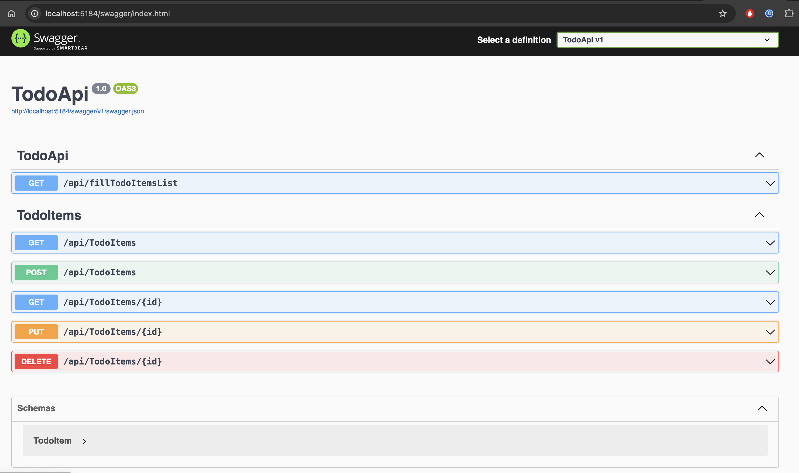

## Introduction

This is a .NET 8.0 API project that implements the Backend part of a Reminder Tasks application.

It provides a REST API with CRUD methods for TodoTasks.

I needed to enable CORS for the requests coming from a separate fronted app in React, which you can also check and download in this other repository [React Frontend App](https://github.com/dantgn/reminder-tasks-frontend)

### Swagger API
A Swagger API documentation comes out of the box, which is very useful.

